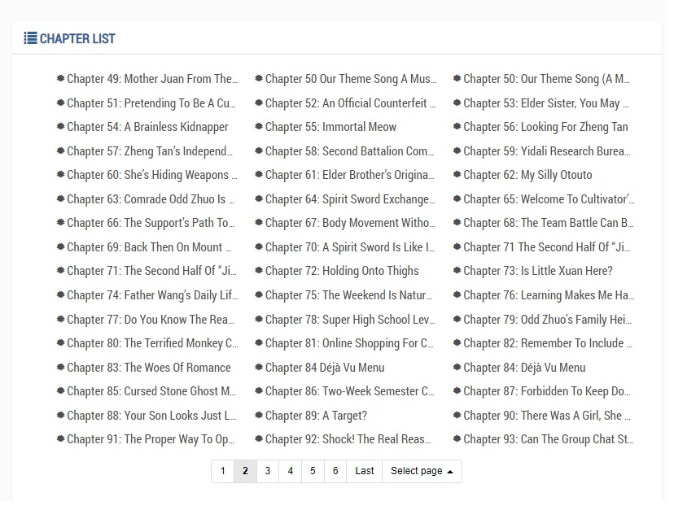
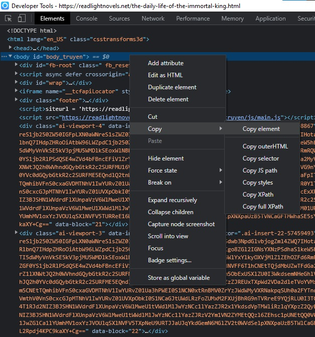
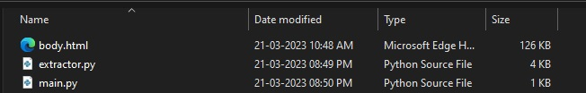
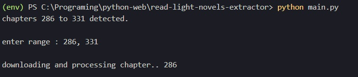

<h1 style="font-size:28px; font-weight: 500"> readlightnovels.net scrapper </h1>

[readlightnovels.net](https://readlightnovels.net/) is a free webnovel sharing website. This tool allows you to scrape the aforementioned website for lightnovels and save them in pdf format on your device.

 

> Please understand that this project is still under devolopment,
> a lot of it's features might seem primitive and uncompleted.  
> Rest assured that I realise this and will work on it in the future, any help is most appreciated!

 

+ Usage  
 
* To use this tool you first need to head over to the [readlightnovels.net](https://readlightnovels.net) webpage of the lightnovel you wish to scrape.

* As, in the picture shown below, make sure you have the chapter list of the chapters you wish to download.

    

* If the chapter list given includes the chapters you wish to scrape, then instpect the page using the shortcut `Ctrl + Shift + i`
* In the inspect panel, right-click on the body element and select 'copy-element' as shown.
 
    
* Save the copied text as 'body.html' in the folder containing the python script.
    > Note : It is very important that the file be called body.html, else the program will not work

* The folder contaning the python script should somewhat look like this 

    

* Run the python script using the correct python interpreter and enter the chapters as shown below, and it will download the chapters for you.

    

+ Features to be incorporated  

     + The first change I plan to make is to make it so that you dont have to copy the html body of the chapter index page. I understand that its a pain to copy and file the html code. Since the chapter list is javascript rendered, I have not yet found a workaround to get the chapter list.
  
     + I would also like to make the resulting pdf document look better. It was my first time working with FPDF module so the PDF looks a little on the untidy side. My apologies.

    + I want to add even more features to this program to make it easier to handle and also improve the output quality. I am having my exams currently so I may not be able to work on this as much as I'd like to :')
  
